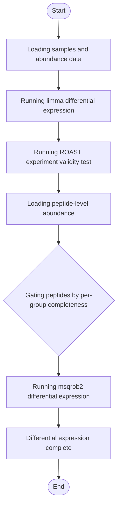

# Lyso-IP Differential Expression


## Installation

**[⬇️ Click here to install in Cauldron](http://localhost:50060/install?repo=https%3A%2F%2Fgithub.com%2Fnoatgnu%2Flysoip-differential-expression-plugin)** _(requires Cauldron to be running)_

> **Repository**: `https://github.com/noatgnu/lysoip-differential-expression-plugin`

**Manual installation:**

1. Open Cauldron
2. Go to **Plugins** → **Install from Repository**
3. Paste: `https://github.com/noatgnu/lysoip-differential-expression-plugin`
4. Click **Install**

**ID**: `lysoip-differential-expression`  
**Version**: 1.0.0  
**Category**: lysoip-qc  
**Author**: CauldronGO Team

## Description

Log2 fold-change and significance (limma or msqrob2, auto-selected) plus a ROAST-based whole-run experiment validity test for lyso-IP data


## Workflow Diagram



## Runtime

- **Environments**: `r`

- **Entrypoint**: `lysoip_differential_expression.R`

## Inputs

| Name | Label | Type | Required | Default | Visibility |
|------|-------|------|----------|---------|------------|
| `abundance_long_file` | Protein Abundance (Long Format) | file | Yes | - | Always visible |
| `samples_file` | Samples | file | Yes | - | Always visible |
| `peptide_abundance_file` | Peptide Abundance (Long Format) | file | No | - | Always visible |
| `impute_method` | msqrob2 Imputation Method | select (MinDet (left-censored, recommended for missing-not-at-random), k-nearest neighbours, None (complete-case aggregation only)) | No | MinDet | Always visible |
| `min_completeness` | Minimum Peptide Completeness | number (min: 0, max: 1, step: 0) | No | 0.3 | Always visible |
| `n_rotations` | ROAST Rotations | number (min: 99, step: 1) | No | 1999 | Always visible |
| `min_proteins_for_validity` | Minimum Proteins for Validity Test | number (min: 1, step: 1) | No | 20 | Always visible |
| `validity_alpha` | Validity Alpha | number (min: 0, max: 1, step: 0) | No | 0.05 | Always visible |

### Input Details

#### Protein Abundance (Long Format) (`abundance_long_file`)

abundance_long.tsv from the Lyso-IP Ingestion plugin


#### Samples (`samples_file`)

samples.tsv from the Lyso-IP Ingestion plugin


#### Peptide Abundance (Long Format) (`peptide_abundance_file`)

peptide_abundance_long.tsv from the Lyso-IP Ingestion plugin. When given, uses msqrob2 instead of limma.


#### msqrob2 Imputation Method (`impute_method`)

Only used when peptide-level data is given. MinDet assumes a missing value is genuinely below detection, not randomly missing.

- **Options**: `MinDet` (MinDet (left-censored, recommended for missing-not-at-random)), `knn` (k-nearest neighbours), `none` (None (complete-case aggregation only))

#### Minimum Peptide Completeness (`min_completeness`)

A peptide needs at least this fraction of replicates present in both the IP and WCL group to be used; only relevant when peptide-level data is given


#### ROAST Rotations (`n_rotations`)

Number of rotations for the ROAST experiment-validity test


#### Minimum Proteins for Validity Test (`min_proteins_for_validity`)

Experiment validity is undetermined (not failed) below this many tested proteins


#### Validity Alpha (`validity_alpha`)

ROAST p-value threshold below which the run is considered to show real differential signal


## Outputs

| Name | File | Type | Format | Description |
|------|------|------|--------|-------------|
| `differential_expression` | `differential_expression.tsv` | data | tsv | Per-protein log2 fold-change, p-value, and adjusted p-value (IP vs WCL) |
| `experiment_validity` | `experiment_validity.json` | data | json | Whole-run ROAST validity test: n_tested, omnibus_pvalue, is_valid (true/false/null if undetermined) |

## Requirements

- **R Version**: >=4.0

### R Dependencies (External File)

Dependencies are defined in: `r-packages.txt`

- `limma`
- `jsonlite`
- `QFeatures`
- `msqrob2`

> **Note**: When you create a custom environment for this plugin, these dependencies will be automatically installed.

## Example Data

This plugin includes example data for testing:

```yaml
  abundance_long_file: examples/abundance_long.tsv
  samples_file: examples/samples.tsv
```

Load example data by clicking the **Load Example** button in the UI.

## Usage

### Via UI

1. Navigate to **lysoip-qc** → **Lyso-IP Differential Expression**
2. Fill in the required inputs
3. Click **Run Analysis**

### Via Plugin System

```typescript
const jobId = await pluginService.executePlugin('lysoip-differential-expression', {
  // Add parameters here
});
```
